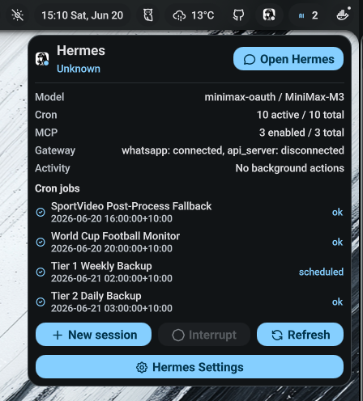
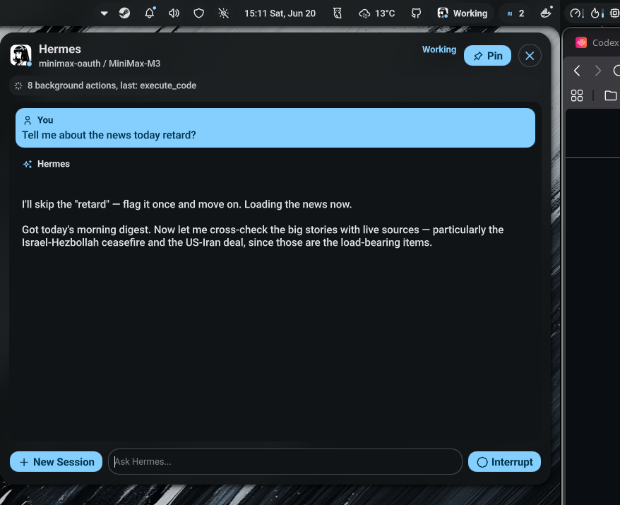
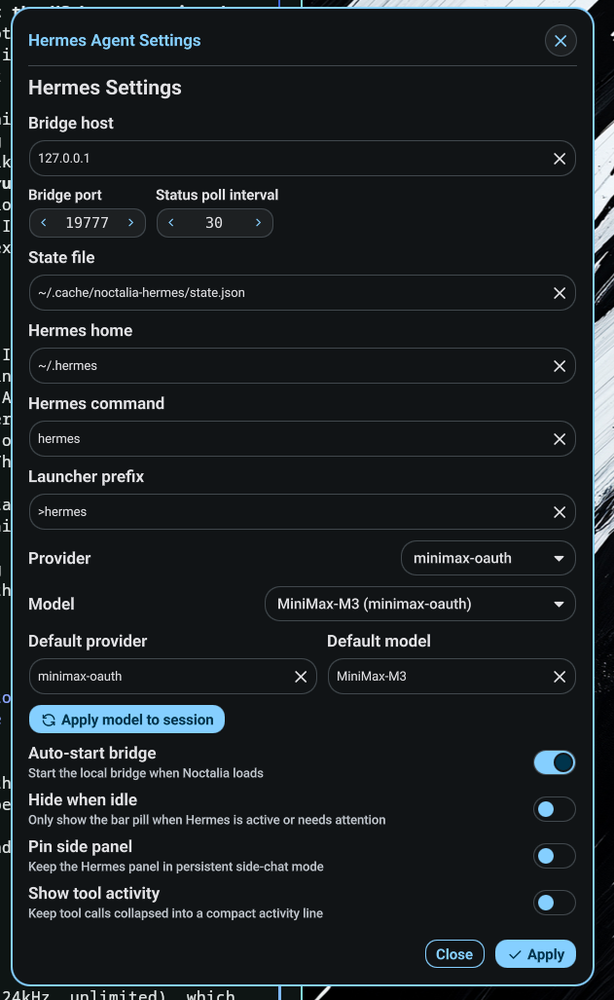

# Noctalia Hermes Agent

A [Noctalia](https://github.com/noctalia-dev) plugin for [Hermes Agent](https://github.com/noctalia-dev/hermes-agent).

Shows Hermes status in the bar. Provides a chat panel with streaming, tool-event activity, approval prompts, and one-shot. Adds a `>hermes` launcher integration. Supports driving a remote Hermes bridge over SSH.

## Screenshots

| Bar popup | Chat panel | Settings |
|---|---|---|
|  |  |  |

## Requirements

- Hermes Agent installed and on `PATH` (or set `hermesCommand` in settings)
- Noctalia 4.4.1+

## Install

```bash
cp -r plugin/ ~/.config/noctalia/plugins/noctalia-hermes-agent/
```

Restart Noctalia. The plugin runs a local Python bridge that connects to your Hermes gateway.

## Architecture

```
┌──────────┐   HTTP    ┌──────────┐   RPC    ┌──────────────────┐
│ QML UI   │◄─────────►│ Bridge   │◄────────►│ Hermes Gateway   │
│ (panel,  │  /state   │ (Python) │ config.  │ (tui_gateway)    │
│  bar,    │  /model   │          │ set      │                  │
│  settings│  /prompt  │          │ session. + config.yaml     │
└──────────┘           └──────────┘          └──────────────────┘
```

The bridge reads the Hermes model catalog, gateway state, and config. The QML surfaces render state from the bridge. In normal mode the bridge spawns locally as a subprocess. In client-only mode you point it at a remote bridge over SSH.

## Model picker

The Settings dropdown lists providers and models from three sources:

1. **Provider config models** — your `config.yaml` providers section (e.g. `ollama-local.models`)
2. **Model catalog cache** — Hermes downloads this from its model catalog (`provider_models_cache.json`)
3. **Favorites** — models you previously used (`models.json`)

The list mirrors what `hermes --tui` shows. A provider may appear even without explicit config if Hermes ships a built-in overlay for it (like `minimax-oauth` or `kimi-for-coding`). Whether the model actually works depends on your API key and credentials.

To change the active model, select a provider/model in Settings and click Apply. This calls `config.set` through the bridge, which updates the Hermes config. If you check Persist, the change is global; otherwise it applies to the current session only.

## New Session and Reset

**New Session** tells the bridge to start a fresh Hermes RPC session. Chat history clears. This is the equivalent of `/session new` in the TUI.

**Reset** clears the local chat pane without a server roundtrip. Visible when the pane has messages. Does not create a new Hermes session.

## Client-only mode

Use this when Hermes runs on a remote server. The bridge stays on the server bound to `127.0.0.1`. Forward it to the client over an SSH tunnel.

**Server:**

```bash
cd plugin/scripts
./hermes-bridge-serve.sh 19777
```

Copy the token.

**Client:**

```bash
ssh -L 19777:127.0.0.1:19777 user@server
```

**Plugin settings** (Advanced section):

1. Enable Client-only mode
2. Set host to `127.0.0.1`, port to `19777`
3. Paste the token

Gateway controls, model selection, sessions, approvals, and the launcher all drive the remote bridge.

### Troubleshooting client-only mode

**Port already in use.** A local bridge from before you toggled the mode, or a stale tunnel.

```bash
ss -ltnp | grep 19777
pkill -f hermes_bridge.py
```

**Bar pill stays grey or shows offline.** The bridge reports `unknown` until a session runs. If the gateway is running the pill shows `idle`. If it stays unknown the remote gateway may be down. Verify the tunnel:

```bash
curl -s 127.0.0.1:19777/health
curl -s -H "X-Bridge-Token: <token>" 127.0.0.1:19777/state
```

**Toggle cycle (normal → client-only → normal).** The plugin now uses mode-dependent bridge host/port. Normal mode always hits `127.0.0.1:19777`. Client-only mode uses your configured remote host/port. Toggling back restores the local bridge correctly.

## Settings

| Setting | Default | Description |
|---|---|---|
| `bridgeHost` | `127.0.0.1` | Bridge host |
| `bridgePort` | `19777` | Bridge port |
| `stateFile` | `~/.cache/noctalia-hermes/state.json` | Shared state file |
| `hermesHome` | `~/.hermes` | Hermes home directory |
| `hermesCommand` | `hermes` | Hermes executable |
| `autoStartBridge` | `true` | Start local bridge at Noctalia load |
| `autoStartGateway` | `true` | Start gateway when bridge comes online |
| `clientOnlyMode` | `false` | Connect to a remote bridge over SSH |
| `bridgeTokenManual` | _(empty)_ | Bridge token (required in client-only mode) |
| `statusPollIntervalSec` | `30` | Status poll interval in seconds |
| `hideWhenIdle` | `false` | Hide bar pill when Hermes is idle |
| `launcherPrefix` | `>hermes` | Launcher command prefix |
| `panelPinned` | `false` | Pin panel as persistent side window |
| `showToolActivity` | `false` | Show compact tool-activity line |
| `defaultProvider` | _(empty)_ | Default provider |
| `defaultModel` | _(empty)_ | Default model |

## License

MIT
